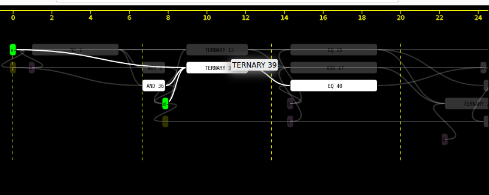

## d3-hwschedulinggraphs

This project is the widget which displays timeline graph (Gantt graph, task scheduling graph).
Its primary purpose is a visualization of circuit scheduling in HLS engines.
Each task may have multiple ports where other taks dependencies are connected.
This widget also have many methods for highlighting and searching as they are required for orientation in larger graphs. 
 
Implemented in TypeScript using d3.js builded by Rollup.js.
Designed to work fast enough for ~10K nodes with 4-9 connections on each node at average.
Runs faster in Chrome than Firefox.

### Out of the box features

* zoom/pan
* dynamic x-axis for time
* onmouseover node detail
* stylable node, link from input json
* inverse highlight for mouse over, and select by click (inverse highlight means that selected thing has oppacity=1 while rest have oppacity<1 and thus it is darker)
* search/highlight from javascript console




## Quickstart

To get started, install dependencies:

```bash
npm install
```

Build the Application

```bash
npm run build
```

Now you can open index.html (no html/webdev server required, but if you are developer consider it)


### Input data format

* JSON, see src/data.ts TimelineData class


Package structure based on:

* https://github.com/tomchen/example-typescript-package
* https://github.com/Lemoncode/d3js-typescript-examples